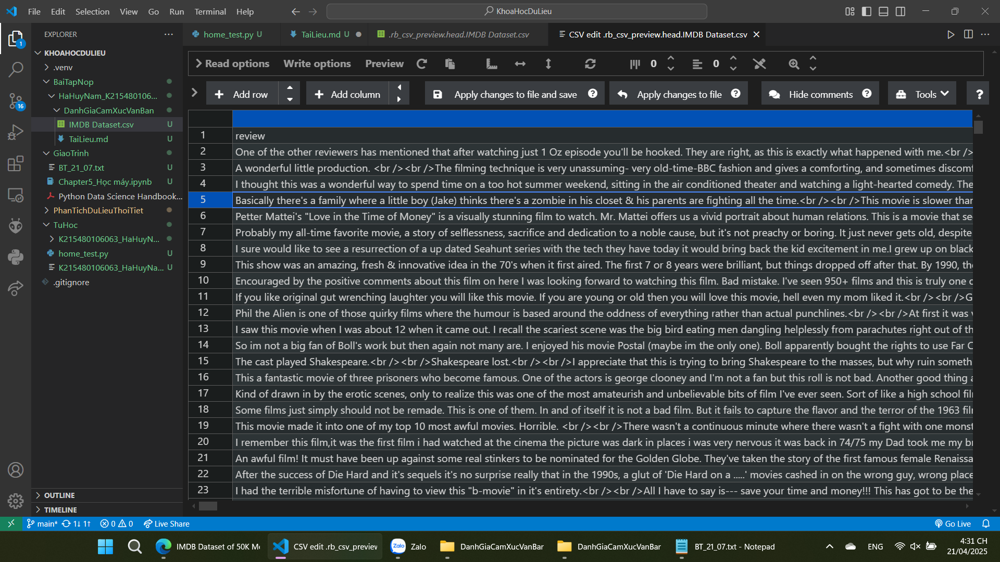
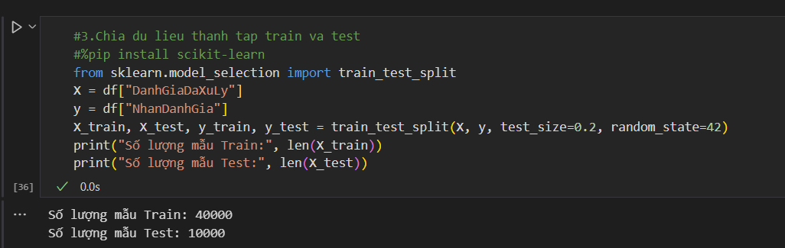
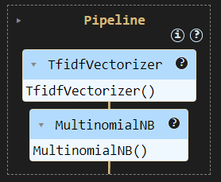
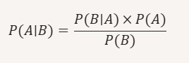
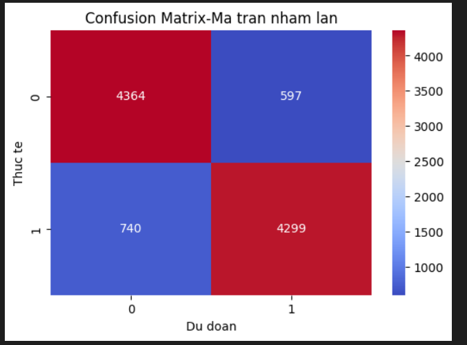
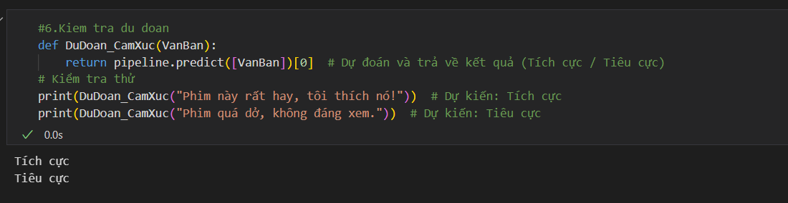

#Bai1: Danh gia cam xuc van ban voi multinomialNB

-Tai dataset tren kaggel, link: https://www.kaggle.com/datasets/lakshmi25npathi/imdb-dataset-of-50k-movie-reviews?resource=download, hien thi mot so du lieu dau tien neu file dung luong lo

-Tien xu ly du lieu, chia tap train va test

-Tao pipeline de tu dong hoa quy trinh tien xu ly va huan luyen mo hinh trong 1 luong duy nhat, giup don gian hoa, tranh lap di lap lai cung 1 buoc khi huan luyen hoac du doan

-Mo hinh Naive Bayes: la mot nhom cac thuat toan phan loai xac xuat dua tren dinh ly bayes, thuong dung trong phan loai van ban, thu rac,... Dua theo cong thuc Naive

-Trong bai nay, toi su dung loai multinominal naive bayes-dung cho phan loai van ban, lam viec voi tan suat tu xuat hien, uu diem: nhanh, hieu qua voi du lieu lon, khong can nhieu du lieu huan luyen, don gian de hieu

-Khi danh gia va du doan mo hinh, toi su dung thu vien seaborn giup truc quan hoa du lieu, dep mat va de hieu, o day ma tran nham lan giup danh gia truc quan chat luong mo hinh phan loai dung hay sai, kiem tra mo hinh bi lech can bang giua cac nhan, neu mo hinh nham tich cuc voi tieu cuc, can cai thien thoat toan, co cac chi so precision, recall, f1 score de toi uu mo hinh

-Ket qua tu ma tran nham lan:
+4364 danh gia tieu cuc da du doan dung
+4299 danh gia tich cuc da du doan dung
+740 danh gia tich cuc bi du doan nham thanh tieu cuc
+597 danh gia tieu cuc bi du doan nham thanh tich cuc
-Ma tran nham lan trong bai nay su dung mot so chi so quan trong duoi day de danh gia
+Ty le chinh xac-accuracy_score(y_test, y_pred): tinh bang cach lay tong so du doan dung/tong so mau kiem tra. Dung de do ty le tong so du doan dung tren tong so mau kiem tra. Neu accuracy_score=90 thi nghia la ty le du doan dung la 90%  
+Bao cao phan loai-classification_report: the hien bang cac chi so precision, recall, f1 score. precision cao-it du doan nham, recall cao-it bo sot du doan dung, f1 score-mo hinh can bang giua precison va recall

-Kiem tra du doan
