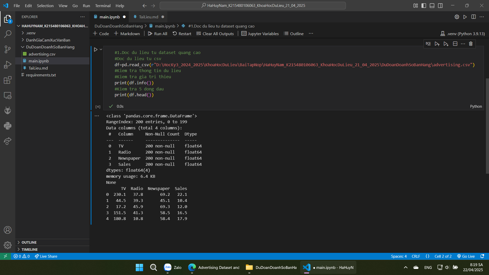
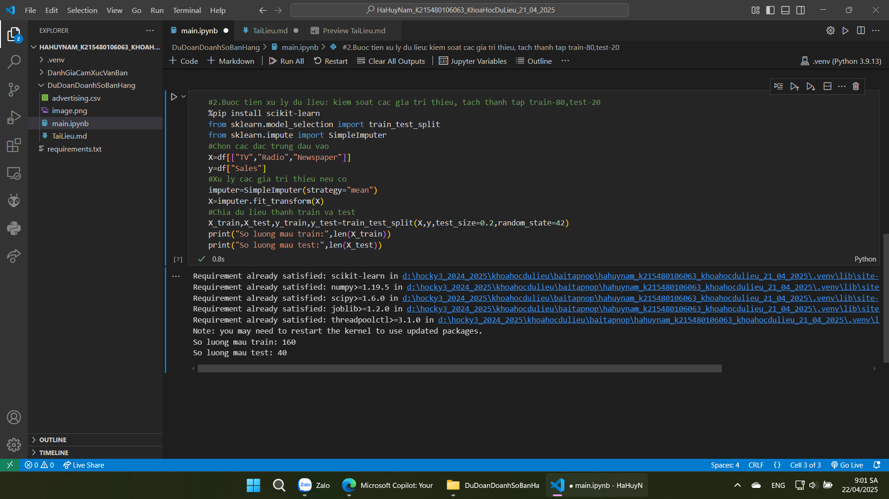
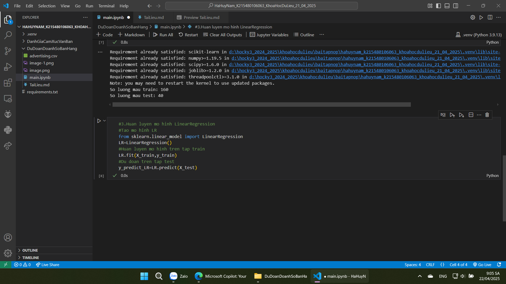
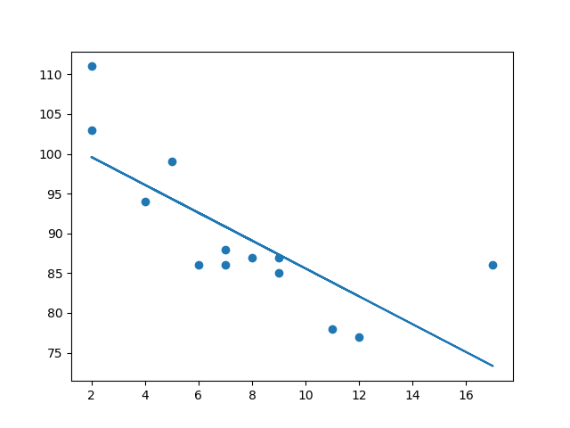
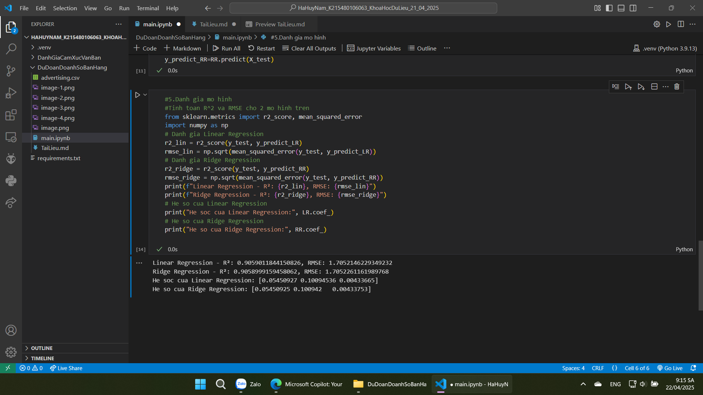
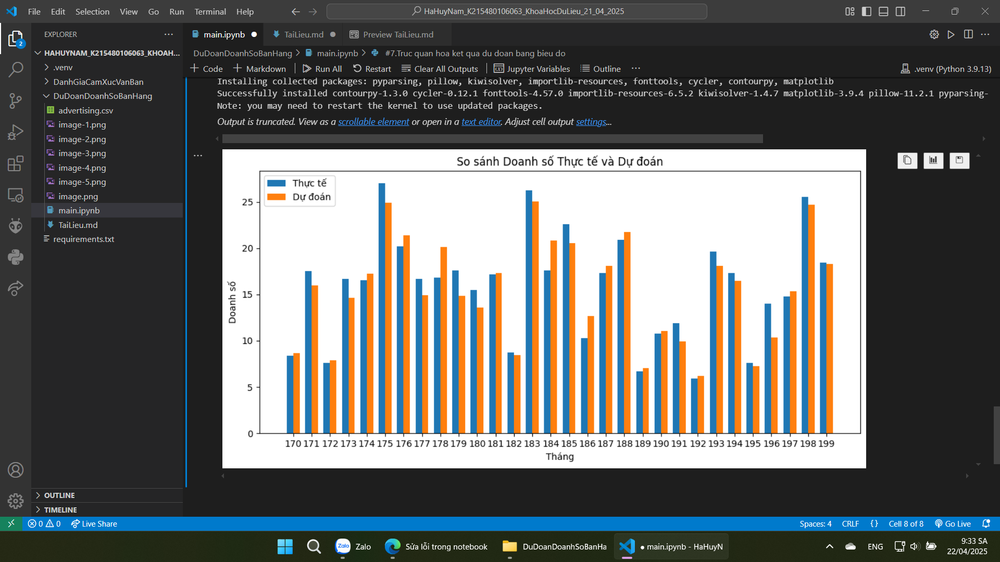

#Bai2: Huan luyen mo hinh du doan doanh so ban hang su dung hoi quy tuyen tinh va regularization
-Muc tieu: co ban nam duoc khai niem ve hoi quy tuyen tinh va regularization va ap dung de huan luyen mo hinh don gian de du doan doanh so
-Tap du lieu doanh do ban hang: https://www.kaggle.com/datasets/ashydv/advertising-dataset/data?select=advertising.csv
-Doc du lieu tu dataset

-Tien xu ly du lieu: Kiem soat du lieu thieu, tach tap train va test. X: du lieu dau vao, vi du nhu 2D. y: nhan dau ra, vi du nhu ma tran 1 chieu

-Huan luyen mo hinh voi LinearRegression

-Linear Regression (Hồi quy tuyến tính) (__Định nghĩa__) là một thuật toán học có giám sát trong Machine Learning, được sử dụng để mô hình hóa mối quan hệ giữa một biến phụ thuộc (output) và một hoặc nhiều biến độc lập (input features)
-Hồi quy được dùng tìm mối quan hệ giữa các biến, trong học máy và thống kê, mối quan hệ đó được sử dụng để dự đoán kết quả tương lai
-Hồi quy tuyến tính sử dụng mối quan hệ giữa các điểm dữ liệu để vẽ một đường thẳng qua tất cả chúng, đường này dùng để dự đoán các giá trị trong tương lai

-Danh gia mo hinh: danh gia hieu suat 2 mo hinh: R^2 cang cao thi du doan cang tot. RMSE cang thap thi sao so du doan cang nho. Danh gia hieu so dac trung cua mo hinh thi he so nao lon nhat se duoc coi la yeu to quan trong nhat-anh huong den doang so ban hang

-Ve bieu do de minh hoa ket qua du doan
