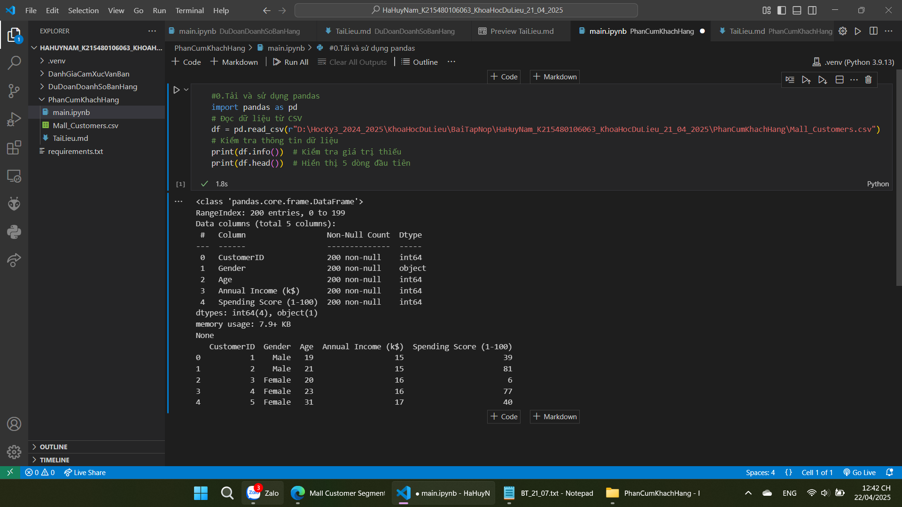
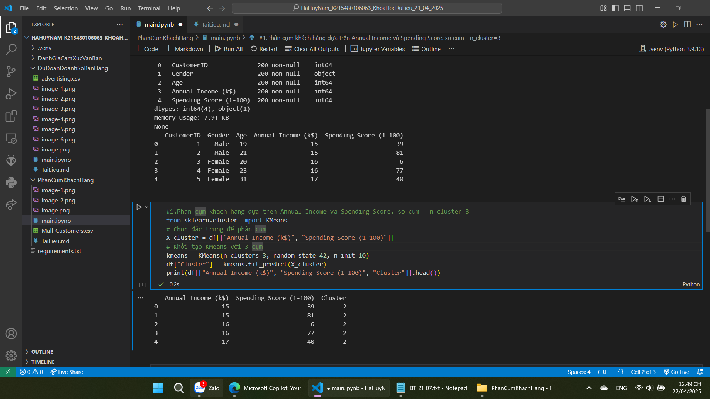
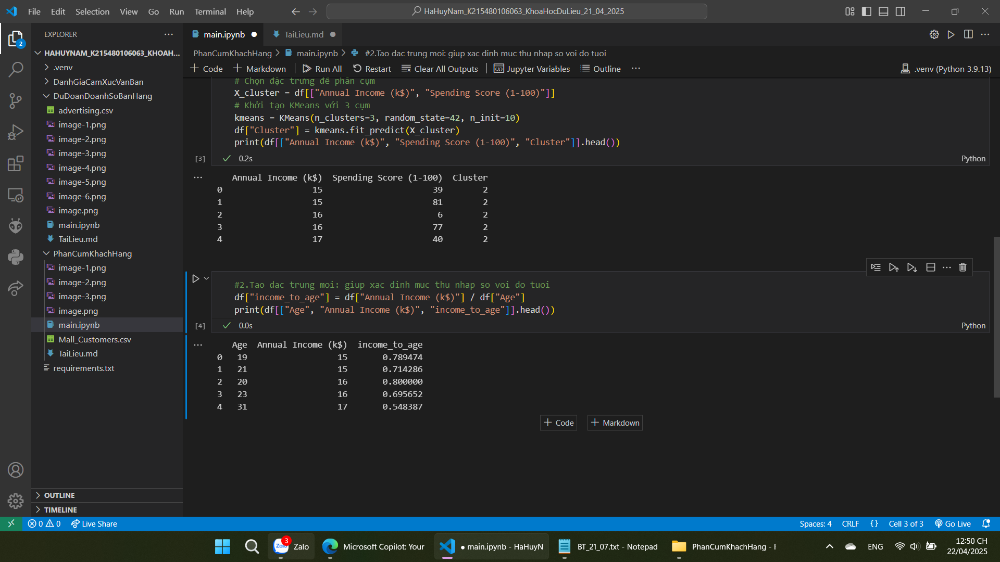
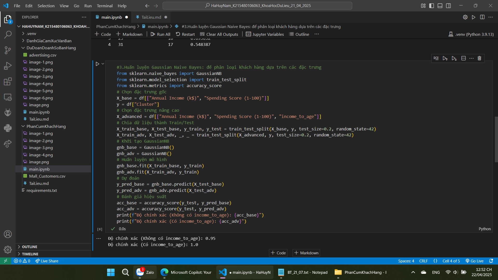
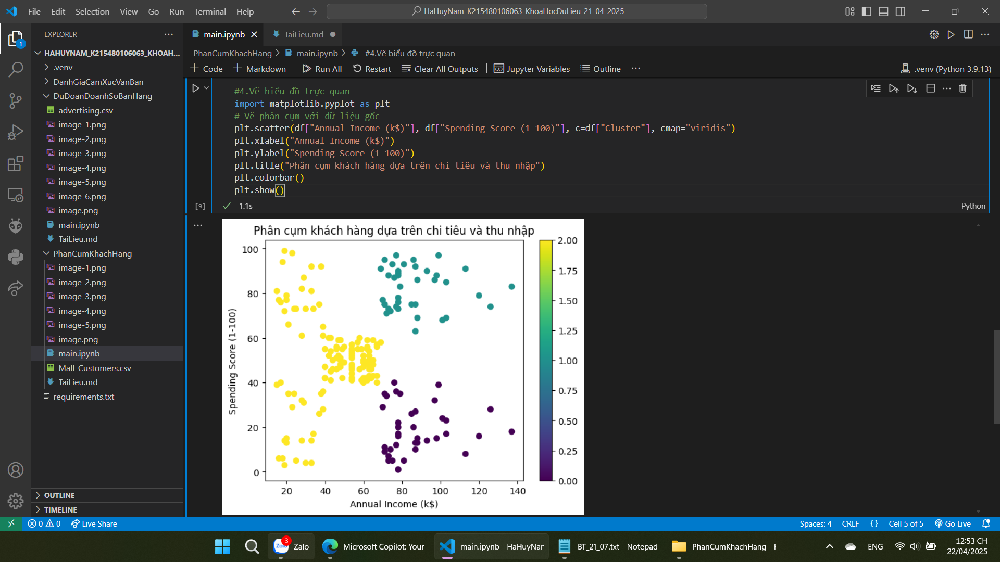

#Bai3:Phan cum khach hang
-Tai dataset: https://www.kaggle.com/datasets/vjchoudhary7/customer-segmentation-tutorial-in-python
-Xem va kiem tra dataset

-Phân cụm khách hàng dựa trên Annual Income và Spending Score. so cum - n_cluster=3

-Tao dac trung moi: giup xac dinh muc thu nhap so voi do tuoi

-Huấn luyện Gaussian Naive Bayes: để phân loại khách hàng dựa trên các đặc trưng

-Ve bieu do truc quan hoa ket qua huan luyen
