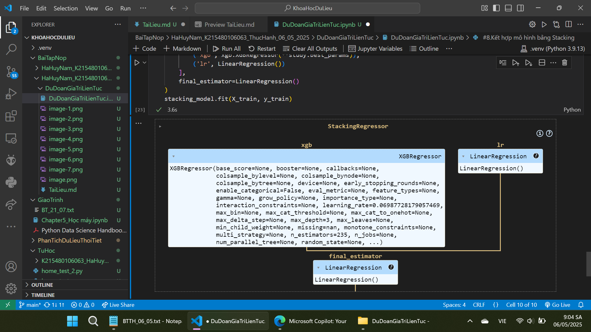

Bai2:Dự đoán giá trị liên tục
#0.

#1.Sử dụng dataset california housing từ sklearn.dataset:*from sklearn.datasets import fetch_california_housing*

#2.Vẽ pairplot để kiểm tra mối quan hệ đặc trưng 

#3.Kiểm tra tương quan tuyến tính với pearson

#4.Xử lý ngoại lai-isolation forest 

#5.Tạo đặc trưng mới

#6.Huấn luyện mô hình 

#7.Tối ưu hóa bằng Bayesian Optimization

#8.Kết hợp mô hình bằng Stacking

#9.Đánh giá mô hình

#10.Phân tích SHAP
